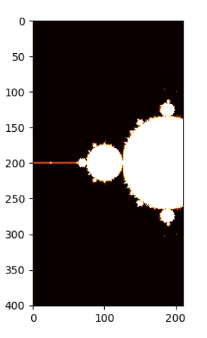

Just Something That I wished to make after watching 3B1B video

Things I Tried and what worked:
1. First I made a basic functioning code and launched it. It was working but the computation was very slow
2. Then I integrated the cProfile.Profiler(), pstats so that I cound use snakeviz to see where my time gets spent the most and have a clear view where the program time gets most spent
3. The graph shows that most of the time is spent in 2 functions namely checkConvergence and complexMatrix.
4. I tired making a c++ function and importing in python, but could not execute this.
5. Finally I found a library called "numba" that allows just in time compilation giving the python functions speed of c++ as long as they fulfil certain critera. This reduced the timeTaken of checkConvergence from 77.4s to 1.74 seconds. (Time Distribution Version 2)
6. Next the most time is taken by complexMatrix function. I used the numpy matrix to take help of vectoriztion and take the time from 29.5s to 0.0736s. (Time Distribution Version 3)
7. Finally, the most significant time was being taking by the loop in loop running in the main function. I tried using things like np-vectorize. But it did not work. Finally what worked was making isConvergent beforehand and applying njit on the loop in looping part. This reduced the loop time to 1.85s.(Time Distribution Version 4) 

 
